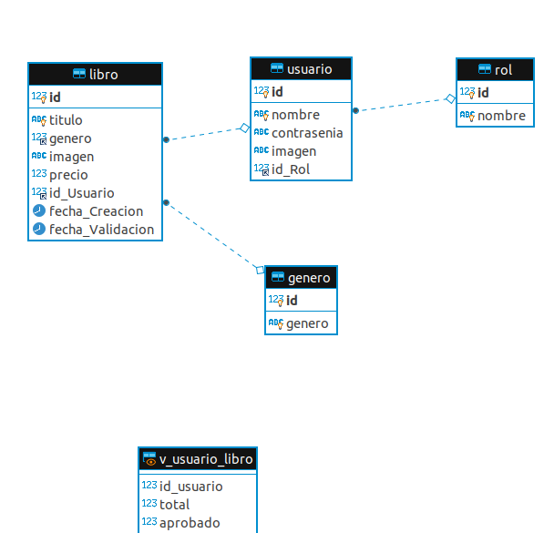

#libreria
@author Joserra
@Version 1.0
Proyecto web **Jsava** siguiendo el patron **MVC** contra una base de datos**MySQL**.
CMS para la gestion de una libreria o pequeña biblioteca.
Hay dos roles diferentes para inicio de sesion. 

1. Usuario [ Benito 123456]
2. Administrador[admin admin]
*Las contraseñas se encuentran cifradas en MD5 dentro de la misma BBDD.*

##Tecnología
- Maven 4.0.0
- java 8
- java servlet Api 3.1.0
- JSP 2.2
- JSTL 1.2
- javax.validation 1.1.0
- bootstrap 4.5.0
- font-awesome 5.13.0
- datatables .net 1.10.21

Para  mas detalles ver [pom.xml](https://github.com/Joserchicar/Liibreria2/blob/master/pom.xml) 

##Configuracion de la BBDD

Para la creacion de la Base de Datos, disponemos de un archivo**libreria-bd.sql** en la raiz del proyecto, el cual crea el esquema de **libreria** y las tablas necesarias ademas de insertar los datos necesarios para la prueba.

Para la conexion con la Base de Datos, dirigirse al fichero ** src/main/webapp/META-INF/context.xml**

´ <?xml version="1.0" encoding="UTF-8"?>
  <Context path="/ejemplo05">
      <Resource
          type="javax.sql.DataSource"
          auth="Container"
          name="jdbc/super"
          driverClassName="com.mysql.jdbc.Driver"
          url="jdbc:mysql://localhost:3306/libreria"
          username="debian-sys-maint"
          password="o8lAkaNtX91xMUcV"
          maxActive="100"
          maxIdle="30"
          maxWait="10000"          
      />
 </Context>  ´
 
 
 
 

##Ejecucion del proyecto

Al tratarse de un proyecto Java , necesitaremos un servidor de aplicaciones.
En este caso el proyecto se encuentra optimizado con ** Apache TOmCat 8.5**

## Estructura  de Clases del Proyecto

Interesante revisar la documentacion [JavaDoc API](src/main/webapp/doc/index.html)

En ella se indica la informacion de las distintas partes del proyecto que podemos encontrarnos.

Ademas, recomendamos consltar la documentacion de los siguientes packages de Java:

- **listener** - que se ejecuta la arrancar la aplicación.

- ** controller.Backoffice** - controlador para Administrador

- ** controller.Frontoffice** - controlador para Usuario 

- **modelo.modeloDAO** - Dao para relacionar los pojos con las tablas de la BBDD

- **modelo.pojo** - Clases para crear objetos de java

- **modelo.seguridad** - Filtros de seguridad-
